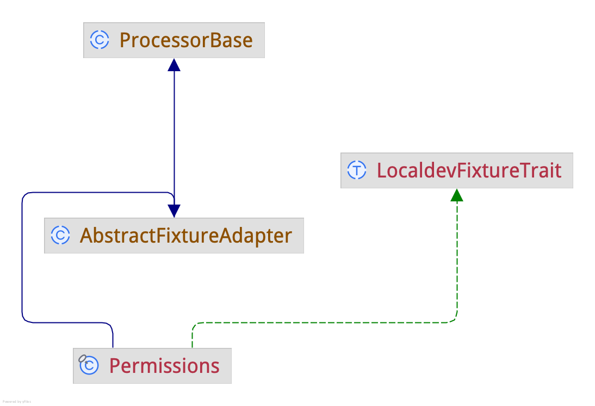

<!--
id: fixture_framework
tags: ''
-->

# Fixture Framework Integration

Integrates [aklump/fixture-framework](https://github.com/aklump/fixture-framework) so fixtures can be executed through the Live Dev Porter processor system. The fixture contains the task to perform, while the _Fixture Runner_ or _Fixture Adapter_ makes fixture(s) runnable as a Live Dev Porter processor.

## Choose an Approach

### Fixture Runner Class

This has the advantage of only requiring one processor to manage all fixtures, simplifying the configuration and maintenance of fixtures. It also leverages the fixture framework's built-in sorting and filtering capabilities, making it easier to manage complex fixture sets.

`.live_dev_porter/processors/Fixtures.php`

{{ example_code.Fixtures_php|fenced }}

* Runners must be declared `final`.
* To control when the adapter runs, override `\AKlump\LiveDevPorter\FixtureFramework\AbstractFixtureAdapter::tryCanProcess`. In this example that has been done in the trait.
* If the fixture requires global options, you provide them in the adapter class by overridding `\AKlump\LiveDevPorter\FixtureFramework\AbstractFixtureAdapter::getGlobalOptions`. Again, this example is doing so in the trait.

### Fixture Adapter Class

Instead of creating one fixture runner processor, create one a processor that extends `\AKlump\LiveDevPorter\FixtureFramework\AbstractFixtureAdapter` for each fixture class. These adapters connect their corresponding fixture to the Live Dev Porter processor workflow.

{{ example_code.FixtureAdapter_php|fenced }}

* Adapters must be declared `final`.
* The adapter class intentionally uses the same short name as the fixture class for readability, but this is only a convention.
* Adapters extend `\AKlump\LiveDevPorter\Processors\ProcessorBase`, so they can use its helper methods and processor context.
* To control when the adapter runs, override `\AKlump\LiveDevPorter\FixtureFramework\AbstractFixtureAdapter::tryCanProcess`. In this example that has been done in the trait.
* If the fixture requires global options, you provide them in the adapter class by overridding `\AKlump\LiveDevPorter\FixtureFramework\AbstractFixtureAdapter::getGlobalOptions`. Again, this example is doing so in the trait.

## Autoloading

* You must add the following to your host project's `composer.json`

```json
{
  "autoload": {
    "psr-4": {
      "AKlump\\LiveDevPorter\\": ".live_dev_porter/src/"
    }
  }
}
```

## Fixture Class

A fixture contains the actual work to be performed. Live Dev Porter provides a processor adapter that invokes it.

Create a Fixture class per [aklump/fixture-framework](https://github.com/aklump/fixture-framework) in `.live_dev_porter/src/Fixture`

{{ example_code.Fixture_php|fenced }}

### Working Directory Is Always the Host Project Base Path

When a fixture runs, Live Dev Porter sets the working directory to the host project base path before execution begins. @see `\AKlump\LiveDevPorter\Processors\ProcessorBase::getHostProjectBasePath();`

## Traits for Simplicity

Traits are optional, but they can reduce boilerplate in adapter classes by consolidating shared behavior.

{{ example_code.LocaldevFixtureTrait_php|fenced }}

## Class Inheritance Diagram



## Managing Fixture Cache

To rebuild the fixture cache, you should use `--processor=flush` when calling the `process` command in Live Dev Porter. @see `\AKlump\FixtureFramework\Helper\GetFixtures::__invoke`

```shell
ldp process Permissions::setUp --processor=flush
```
